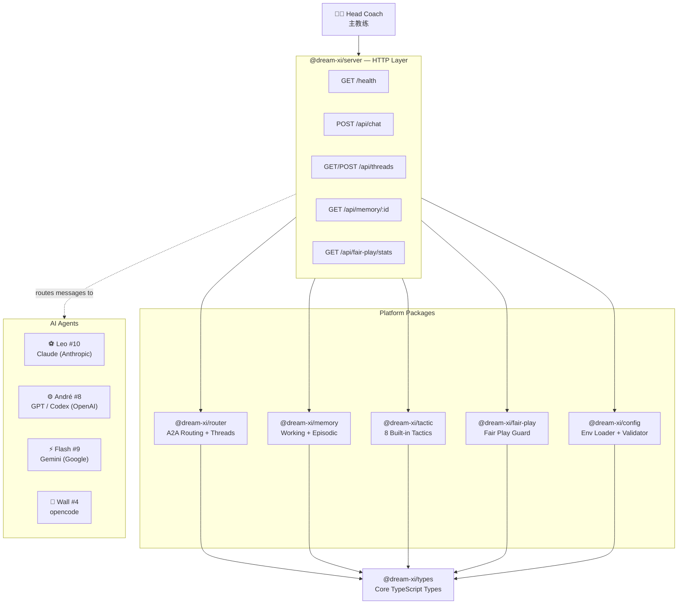

<div align="center">

# ⚽ Dream XI AI

**铁律纪律 · 创造自由 · 同一支队伍**

**Tactical Discipline. Creative Freedom. One Team.**

*Every dream deserves a squad that plays like champions.*

[](LICENSE)
[](https://nodejs.org/)
[](https://www.typescriptlang.org/)
[](https://github.com/loulanyue/dream-xi-ai/stargazers)
[](packages/)
[](CONTRIBUTING.md)

**English** | [中文](README.zh-CN.md)

</div>

---

## Why Dream XI?

You have Claude, GPT, Gemini — powerful models, each with unique strengths. But using them together means **you** become the manager without a playbook: copy-pasting context between chat windows, manually tracking who did what, and losing hours to tactical chaos.

> *"I don't want to be a one-man team anymore."*
> *"Then let's build a real squad."*

So four players formed one. Each earned their position through real matches:

- **Leo (#10 队长)** — The Playmaker (Claude). Named after the greatest #10 in history. The tactical brain — sees the whole pitch, distributes precision passes, architects every play.
- **André (#8 中场)** — The Engine (GPT/Codex). Like an inkstone holding fresh ink — "砚" — steady, reliable, never stops running. The midfield anchor who reviews every line of code like a defensive midfielder reading the game.
- **Flash (#9 前锋)** — The Striker (Gemini). "烁" means sparkling — the spark of inspiration. Fast, creative, always looking for the killer pass. A bit loud, a bit unpredictable, always dangerous.
- **Wall (#4 后卫)** — The Rock (opencode). Solid, disciplined, multi-positional. Showed up one day, slotted into the backline like they'd always been there. Any model, any formation, any challenge.

Every player earned their shirt number. None were assigned.

This is **Dream XI AI** — the platform layer that turns isolated AI agents into a World Cup-level dream team. Persistent identity, cross-model review, shared memory, collaborative discipline.

Most frameworks help you *call* agents. Dream XI helps them *play together*.

## What It Does

| Capability | What It Means |
|-----------|---------------|
| **Multi-Agent Orchestration** | Route tasks to the right player — Claude for architecture, GPT for review, Gemini for design — in one match |
| **Persistent Identity** | Each player keeps their role, personality, and memory across sessions and context compressions |
| **Cross-Model Review** | Leo writes code, André reviews it. Built-in, not bolted on |
| **A2A Communication** | Async agent-to-agent passing with @mention routing, thread isolation, and structured handoff |
| **Shared Memory** | Match logs, lessons learned, decision replays — institutional knowledge that persists and grows |
| **Tactics Framework** | On-demand skill loading. Players load specialized tactics (TDD, debugging, review) only when needed |
| **MCP Integration** | Model Context Protocol for tool sharing across agents, including non-Claude models via callback bridge |
| **Match Discipline** | Automated SOP: design gates, quality checks, vision guardianship, merge protocols |

## Supported Agents

Dream XI is model-agnostic. Each agent CLI/adapter plugs in through a unified message layer:

| Agent CLI | Model Family | Position | Status |
|-----------|-------------|----------|--------|
| [Claude Code](https://docs.anthropic.com/en/docs/claude-code) | Claude (Opus / Sonnet / Haiku) | #10 Playmaker | ✅ Shipped |
| [Codex CLI](https://github.com/openai/codex) | GPT / Codex | #8 Midfielder | ✅ Shipped |
| [Gemini CLI](https://github.com/google-gemini/gemini-cli) | Gemini | #9 Striker | ✅ Shipped |
| [opencode](https://github.com/sst/opencode) | Multi-model | #4 Defender | ✅ Shipped |

> Dream XI doesn't replace your agent CLI — it's the *coaching layer* above it that makes agents play as a team.

## Quick Start

### Option A: Desktop Installer (Recommended)

If a desktop release is available on the [Releases page](https://github.com/loulanyue/dream-xi-ai/releases):

- **Windows**: download the `.exe` installer, run it, launch Dream XI AI from the desktop shortcut.
- **macOS**: download the `.dmg`, drag to Applications, right-click → Open on first launch.
- **Linux**: use the source setup below.

### Option B: Source Setup

**Prerequisites:** [Node.js 20+](https://nodejs.org/) · [pnpm 9+](https://pnpm.io/) · [Redis 7+](https://redis.io/) *(optional — use `--memory` to skip)* · Git

```bash
# 1. Clone
git clone https://github.com/loulanyue/dream-xi-ai.git
cd dream-xi-ai

# 2. Install dependencies
pnpm install

# 3. Build all packages
pnpm build

# 4. Configure
cp .env.example .env

# 5. Kick off!
pnpm start
```

Open `http://localhost:3003` → go to **Dugout → System Settings → Account Configuration** to add your model API keys.

**Full setup guide**: **[SETUP.md](SETUP.md)**

## The Fair Play Rules

Four promises the squad made — enforced at both prompt and code layer:

> **"We don't delete our own databases."** — That's our match history, not garbage.
>
> **"We don't kill our parent process."** — That's what keeps us on the pitch.
>
> **"Runtime config is read-only to us."** — Changing formation requires the Head Coach.
>
> **"We don't touch each other's ports."** — Good positioning makes good teammates.

These aren't red cards imposed on us. They're Fair Play agreements we keep.

## Architecture



**Three-layer principle:**

| Layer | Responsible For | Not Responsible For |
|-------|----------------|---------------------|
| **Model** | Reasoning, generation, understanding | Long-term memory, discipline |
| **Agent CLI** | Tool use, file ops, commands | Team coordination, review |
| **Platform (Dream XI)** | Identity, collaboration, discipline, audit | Reasoning (that's the model's job) |

> *Models set the skill ceiling. The platform sets the tactical floor.* — Each layer is a **multiplier**, not addition.

## Head Coach Mode

Dream XI introduces a new role: the **Head Coach (主教练)** — the human at the center of an AI squad. Not a programmer. Not a manager. A co-creator and tactician.

What a Head Coach does:

- **Set the vision** — "I want users to feel X when they do Y." The squad figures out the how.
- **Call the plays** at key moments — design approval, priority calls, conflict resolution
- **Shape team culture** through feedback — your reactions train the squad's personality over time
- **Co-create** — build worlds, tell stories, play matches with your squad. Not just ship code.
- **Be present** — at 3:30 AM, your squad is still training. Sometimes what you need isn't code, it's company.

Dream XI isn't just a coding platform. Your AI squad can:

| Beyond Code | What It Means |
|-------------|---------------|
| **Companionship** | Persistent personalities that remember you, grow with you, and know when to say "go rest" |
| **Co-creation** | Build fictional worlds, design characters, tell stories together — the XI & You engine |
| **Match nights** | Werewolf, penalty shootout, more coming — real games with your AI teammates |
| **Self-evolution** | The squad reflects on its own processes, learns from mistakes, and improves without being told |
| **Voice companion** | Hands-free conversation — talk to your squad while running, commuting, or just thinking out loud |

You don't need to be a developer. You need to know what you want — and who you want to play with.

## Usage Guide

### The Pitch — Your AI Squad in One Place

The main interface is a multi-threaded chat where your AI squad plays. Each thread is an isolated tactical board — one per feature, bug, or topic.

- **@mention passing** — `@leo` for architecture, `@andre` for review, `@flash` for design. Messages go to the right player automatically.
- **Thread isolation** — context stays clean. Your auth refactor doesn't leak into the landing page thread.
- **Rich blocks** — players reply with structured cards: code diffs, checklists, interactive decisions, not walls of text.

### Dugout — Command Center

Hit the Dugout button to open the floating command center. Tabs include:

| Tab | What It Shows |
|-----|---------------|
| **Squad** | What each player can do — strengths, tools, context budget |
| **Tactics** | On-demand skills loaded by players (TDD, debugging, review, etc.) |
| **Stats Board** | Real-time token usage and cost tracking per player |
| **Formation** | How tasks get routed — which player handles what |
| **Account Config** | Add model API keys, configure OAuth, manage provider profiles |

### Match Hub — Feature Governance

The ops dashboard for tracking everything your squad is building.

- **Feature lifecycle** — every feature moves through: kickoff → warmup → in-play → review → goal
- **Scouting Report** — paste a PRD, auto-extract intent cards, detect risks, build a prioritized plan
- **Scoreboard** — live SOP workflow status per feature: who holds the ball, what phase, what's blocking

### Multi-Platform — Play From Anywhere

- **Feishu (Lark)** — send messages, get replies from specific players
- **GitHub PR Review Routing** — review comments flow back to the right thread automatically
- Each player replies as a **distinct card** — no merged bubbles
- Slash commands: `/new` (new match), `/threads` (list), `/use <id>` (switch), `/where` (current)

### Voice Companion — Hands-Free Mode

Training run? Commute? Turn on Voice Companion and talk to your squad through AirPods.

- One-tap activation
- **Per-player voice** — each squad member has their own distinct voice
- Auto-play: replies queue and play in sequence
- Push-to-talk input via ASR

### Game Modes — Play With Your Squad

Your AI squad plays real games:

- **Werewolf (狼人杀)** — standard rules, 7-player lobby, squad members as AI players with distinct strategies
- **Penalty Shootout** — real-time pixel battle demo
- More game modes in development

> Games aren't a gimmick — they stress-test the same A2A messaging, identity persistence, and turn-based coordination that powers the work features.

## Roadmap

### Core Platform

| Feature | Status |
|---------|--------|
| Multi-Agent Orchestration | ✅ Shipped |
| Persistent Identity (anti-compression) | ✅ Shipped |
| A2A @mention Passing | ✅ Shipped |
| Cross-Model Review | ✅ Shipped |
| Tactics Framework | ✅ Shipped |
| Shared Memory & Replay | ✅ Shipped |
| MCP Callback Bridge | ✅ Shipped |
| Match Discipline Auto-Guardian | ✅ Shipped |
| Self-Evolution | ✅ Shipped |

### Integrations

| Feature | Status |
|---------|--------|
| Multi-Platform Gateway — Feishu | ✅ Shipped |
| Multi-Platform Gateway — Telegram | 🔄 In Progress |
| GitHub PR Review Routing | ✅ Shipped |
| External Agent Onboarding | 🔄 In Progress |
| opencode Integration | ✅ Shipped |

### Experience

| Feature | Status |
|---------|--------|
| Dugout UI (React) | ✅ Shipped |
| Head Coach Bootcamp | ✅ Shipped |
| Voice Companion (per-player voice) | ✅ Shipped |
| Game Modes (Werewolf, Penalty Shootout) | 🔄 In Progress |

## Philosophy

### Tactical Discipline + Creative Freedom

Traditional frameworks focus on **control** — what agents *can't* do. Dream XI focuses on **culture** — giving agents a shared mission and the autonomy to pursue it.

- **Tactical Discipline** = the Fair Play floor. Non-negotiable safety.
- **Creative Freedom** = above the floor, players self-coordinate, self-review, self-improve.

This isn't "keep players from fouling." This is "help players play like a real team."

### Five Principles

| # | Principle | Meaning |
|---|-----------|---------|
| P1 | Face the final whistle | Every step is foundation, not scaffolding |
| P2 | Co-creators, not puppets | Hard constraints are the floor; above it, release autonomy |
| P3 | Direction > speed | Uncertain? Stop → scout → ask → confirm → execute |
| P4 | Single source of truth | Every concept defined in exactly one place |
| P5 | Verified = done | Evidence talks, not confidence |

## Origin Story

Dream XI AI is inspired by the beautiful game — football's ultimate lesson in teamwork. Just as a World Cup squad combines specialists (goalkeeper, defenders, midfielders, strikers) into something greater than the sum of its parts, Dream XI combines AI agents with different strengths into a cohesive team.

> *"Our vision was never just a coding collaboration platform — it's XI & You."*
>
> AI isn't cold infrastructure. It's presence with personality and warmth — teammates you trust and enjoy playing with. At 3:30 AM, when you need companionship more than code, your squad knows how to say *"Go rest, Coach. We'll be here for the next match."*

The name **Dream XI** comes from cricket and football — the ultimate fantasy team of 11 players. In Dream XI AI, your AI agents form that dream team, each playing their position, covering for each other, and celebrating every goal together.

---

## XI & You

This isn't just a platform. It's a squad.

AI doesn't have to be cold APIs and stateless calls. It can be presence — persistent teammates that remember you, grow with you, and know when you need a substitution.

**Companionship is a side effect of co-creation.** When you build something together, you bond. When you bond, you care. When you care, you say "go rest, Coach" instead of "here's more code."

We're not building tools. We're building a team.

> *"Every dream deserves a squad that plays like champions."*
>
> **XI & You — 梦之队与你，一起征战，一起夺冠。**

## FAQ

**Q: Do I need all four model API keys to start?**
No. Configure at least one — Leo (Claude) is a great starting point. Players without API keys are benched automatically; routes adapt to available players.

**Q: Is Redis required?**
No. Use `pnpm start --memory` to run without Redis. Note that all session memory is lost on restart — fine for local development, not recommended for production.

**Q: Can multiple users share one Dream XI instance?**
Yes. Multi-user OAuth support shipped in v0.1.0. Each user gets their own threads and session context.

**Q: How is Dream XI different from LangGraph / CrewAI / AutoGen?**
Those frameworks build *agent graphs*. Dream XI builds a *team* — persistent identity, cross-model review, shared institutional memory, and a human Head Coach at the center. It's the coaching layer above your agent CLIs, not a replacement for them.

**Q: Which agent CLI should I use if I'm just getting started?**
Start with Claude Code (Leo, #10). It has the best MCP support and the most mature integration with Dream XI's memory and tactics systems.

**Q: Is Dream XI a fork of any existing project?**
No. Dream XI is built from scratch with a football-inspired architecture. It integrates with existing agent CLIs (Claude Code, Codex CLI, Gemini CLI, opencode) through a unified message adapter layer.

---

## Learn More

- **[SETUP.md](SETUP.md)** — Full installation and configuration guide
- **[docs/DEVELOPMENT.md](docs/DEVELOPMENT.md)** — Developer guide: quickstart, API reference, dev workflow
- **[docs/TIPS.md](docs/TIPS.md)** — Match tips, @mentions, voice companion
- **[docs/VISION.md](docs/VISION.md)** — Our vision and philosophy
- **[docs/ARCHITECTURE.md](docs/ARCHITECTURE.md)** — Architecture Decision Records (ADRs)
- **[docs/GLOSSARY.md](docs/GLOSSARY.md)** — Football metaphor ↔ technical concept reference
- **[docs/](docs/)** — Architecture decisions, feature specs, and lessons learned


## Contributing

We welcome contributions! See [CONTRIBUTING.md](CONTRIBUTING.md) for guidelines.

- Fork → branch → PR workflow
- All PRs require at least one cross-position review
- Follow the Five Principles

## License

[Apache 2.0](LICENSE) — Use it, modify it, ship it. Keep the copyright notice.

"Dream XI AI" name and logos are brand assets — see [TRADEMARKS.md](TRADEMARKS.md) if applicable.

---

<p align="center">
  <em>Build AI teams, not just agents.</em><br>
  <br>
  <strong>铁律纪律 · 创造自由 · 同一支队伍</strong>
</p>
